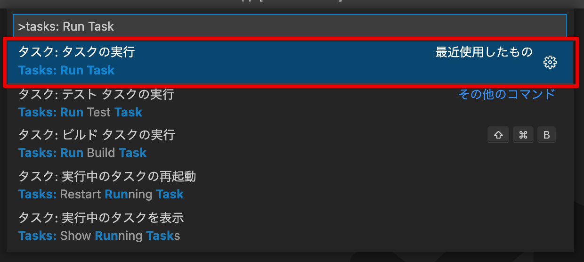

# Example PJ

これは、下記のソフトウェアを組み合わせたサンプルプロジェクトです。
画面ははmuiのサンプルを使用しています。

* vscode
* remote container
* react
* docker
* mui

```
.
├── .devcontainer
│   ├── DockerFile          # イメージのbuild時に実行
│   ├── create.sh           # コンテナの起動時に実行
│   ├── docker-compose.yml  # dockerの制御
│   └── devcontainer.json   # Dockerfileとcreate.shを実行するよう設定
├── .vscode
│   ├── extensions.json     # 推奨パッケージを設定
│   ├── launch.json         # vscodeデバック機能でFastAPIが実行できるよう設定
│   ├── settings.json       # コードフォーマッタなどのvscode設定
│   └── tasks.json          # npm run startを自動で実行
├── README.md
├── docs                    # READEME.mdで使用
└── src                     # ソースコード
```

## 環境構築

Macでのセットアップ方法を紹介します。

### 必要GUIアプリケーションのインストール

homebrewを使用します。  
インストールされていない場合はこちらのインストールスクリプトを使用します。

```
/bin/bash -c "$(curl -fsSL https://raw.githubusercontent.com/Homebrew/install/HEAD/install.sh)"
```

必要アプリケーションをインストール。  

```
brew install --cask visual-studio-code
brew install --cask docker
```

### 拡張機能のインストール

[Remote - Containers](https://marketplace.visualstudio.com/items?itemName=ms-vscode-remote.remote-containers)をvscodeにインストール。

### コンテナの展開

このリポジトリのソースをクローンして、vscodeで開く。  
右下の表示または、「command」+「p」から「Reopen in Container」を選択。


### taskの実行

タスクを使用してreactを実行します。




自動実行を許可することで、フォルダーを開いた際に自動実行することができます。

[Tasks in Visual Studio Code](https://code.visualstudio.com/docs/editor/tasks#_run-behavior)


### デバックの機能

「F5」からデバックを使用してブラウザを起動します。  


この操作を行うことで、ブラウザのコンソールをvscodeで確認できます。また、ブレイクポイントといったデバック機能を使用することができます。

## devcontainer.jsonについて

[devcontainer.json reference](https://code.visualstudio.com/docs/remote/devcontainerjson-reference)

__Dockerfile__  
build時に実行される。

__devcontainer.json "onCreateCommand"__  
コンテナ起動時に実行するコマンドを記載できます。  
フォルダーがbindされた後に実行されるので、bashスクリプトを指定することで任意のコマンドが実行できます。

__docker-compose.yml__
node_modulesなどのファイル入出力高速化のためにbindを設定。
